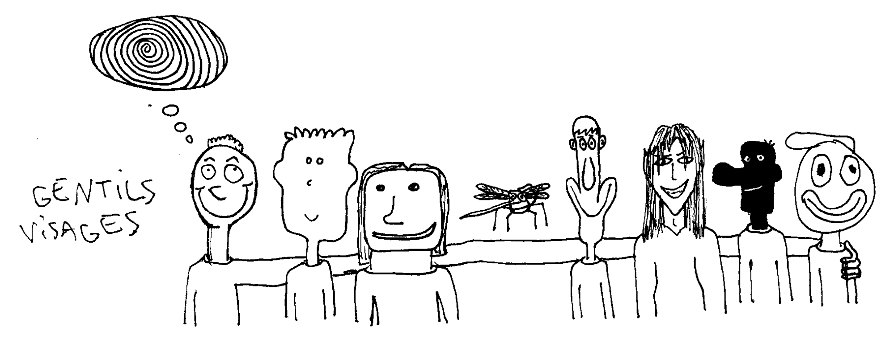

# Introduction

Comment mieux connaître vos amis ? En savoir plus sur leurs rêves, leurs aspirations, leurs intérêts et même leurs peurs ? J'ai demandé, carrément !

J'ai écrit un questionnaire qui aborde divers scénarios théoriques et l’ai soumis à mes amis proches. Ce livre est une compilation de leurs réponses, avec leur permission.

-- **Manfred**

# Faisons connaissance !

## Quels sont tes films préférés ?

La trilogie Back to the Future, Begin Again, The Blind Side et la trilogie Before Sunrise, Before Sunset et Before Midnight.

(Oui, je sais, ce ne sont que des «feel good» movies).

-- **Alex**

La Grande Vadrouille, Léon, Les Bronzés font du ski, Retour vers le Futur.

-- **Tcharly**

Le dernier qui m'a marqué et que j'aime beaucoup c'est «Les 4 aventures de Reinette et Mirabelle» d' Eric Rohmer

sinon «Priscilla, folle du désert»

«Fous d'Irène» avec Jim Carrey et

«Le fils de Bach» de Samuel Boudier.

-- **Gajeb**

Les films où une bande de personnes qui a priori n'auraient jamais dû oeuvrer ensemble réussissent pour on ne sait quelle raison à le faire, il faut que les films soient drôles.

-- **Martin Guggi**

Là maintenant, je n'en ai pas.

Avant c'était «J'ai tué ma mère» de Dolan et «Le Filmeur de Cavalier».

-- **Mez**

Aaltra.

-- **Mxs**

* Totoro
* Ponyo
* La Belle et la Bête
* Ghost in the Shell Innocence
* A Single Man.

-- **Newton**

* The Big Lebowski
* Les Tontons Flingueurs (même s'il a mal vieilli)
* La Vague
* Fight Club
* The Usual Suspect

-- **Peyo**

Je n'ai jamais été fan de quelqu'un ou de quelque chose, je ne comprends pas le fait d'avoir une couleur préférée. Dans l'immensité des films, c'est très compliqué à définir pour moi !

Mais je peux te citer le dernier film qui m'a touché «Le sel de la terre» de William Wenders sur Sabastiao Salgado !

-- **Pieranus**

* Eh mec ! Elle est où ma caisse ?
* Kiss Kiss Bang Bang
* Moi, moche et méchant

-- **Romz**

J'ai toujours aimé Into the Wild et Captain Fantastic, mais ce ne sont plus mes films préférés maintenant. J'adore Tucker and Dale versus Evil, vraiment, regardez ce film.

-- **Altorosa**

* La soupe aux choux
* Interstellar

-- **Sassou**

* La filmo de Paul Thomas Anderson
* Moonrise Kingdom
* Eternal Sunshine of The Spotless Mind
* 12 Angry Men
* Kuzco l'Empereur Mégalo

-- **Théo**

* Fight club
* Le tatoué
* Le roi et l'oiseau

-- **Thomas Dumond**

J’en ai trop, y'a pas assez de place...

1 par catégorie :

* LOTR 1 (heroic fantasy)
* Star Wars 6 (sf)
* Bienvenue à Zombieland (mvt)
* Dîner de cons ou Les Visiteurs (com fr)
* The Dark Knight (super hero)
* Idiocracy (com us)
* Pulp Fiction (Tarantino)
* Grease (musical)
* Shining (horror)
* Imitation Game (biopic)
* Princess Mononoke (animation)
* Pirate des Caraïbes (pirate)

Je suis sûr j'en ai d'autres dans mon top, mais bon si il faut choisir.

-- **Tomassin**

«Victoria».

Film allemand de 2015 tourné en plans séquence, à Berlin. Un bijou pour plusieurs raisons :

1. les acteurs réalisent une vraie performance.
2. le film est une pépite de réalisation technique, un vrai défi très ambitieux qui, à mon sens, a été parfaitement relevé.

* DIG! (rock'n'roll, vraiment ! Docu sur le Velvet Underground & le Brian Johnstown Massacre)
* La Haine
* Berlin Calling
* iBoy (graphiquement intéressant, mais en soi assez basique)

-- **zôÖma**

## Quelles sont tes musiques préférées ?

J'aime bcp les musiques de film qui ont qqchose d'épique, et j'ai pdt toute une partie de mon enfance été complètement obsédée par la musique de «Jurassic park»

-- **Alex**

Rock, rock et aussi un peu de rock.

-- **Tcharly**

Celle que j'écoute en ce moment s'appelle «Les petites abeilles», elle est super.

-- **Gajeb**

Les musiques qui me font danser, rire et réfléchir en même temps.

-- **Martin Guggi**

J'ai pas de musiques préférées parce que je ne suis pas mélomane et je sais qu'on n'a pas besoin d'être mélomane pour avoir des musiques préférées, mais ce que je veux dire c'est que j'écoute des musiques, unitaires, très aléatoirement et je les aime également aléatoirement, par phases.

En ce moment c’est Jaloux de Bilal Hassani, Delirium de Gargäntua, Bout de bois et Le cassoulet de Salut c’est cool.

-- **Mez**

* Aphex twin - Polynomial C, Rone - Bora (vocal)
* Aphex twin, Boards of Canada, Above & Beyond, lone, lorn, rone
* Warp Records + Rephlex + R&S + planet mu

-- **Newton**

* Aphex Twin - Window Licker (et globalement pas mal d'électro dans le style, jusqu'à Caravan Palace).
* La chevauchée des Walkyries (mais uniquement a 200000db, pas en dessous).
* Idem pour Bohemian Rhapsody de Queen.

-- **Peyo**

Comme la question d'avant, beaucoup !

* Remember Me de Blue Boy
* I for the... Labi Siffre
* We almost Lost de Gil Scott Heron
* 4 saisons de Vivaldi
* Princes of the Universe/under Pressure
* California Dreaming de Lee Moses
* How long will it take de Jeff Buckley et Gary Lucas
* Rage Against the Machine que j'aime beaucoup

La liste est encore très très longue...

-- **Pieranus**

Franchement Gargantua ça tue.

Je dis pas ça parce que c'est mes copains, mais parce que c'est vraiment le style de techno que j'adore.

Tous leurs sons sont de pures merveilles.

«<3» est ma préférée.

À part ça, j'adore l'OST d'Undertale et Francis Cabrel. Et tous les groupes de rock et de metal sur Terre.

-- **Altorosa**

Les fleurs de Salut c'est cool.

-- **Sassou**

* La 4e symphonie de Beethoven
* West région inquisitor
* Aerodynamic de daft punk

D'autres pertinentes auxquelles je ne parviens malheureusement pas à me rappeler présentement...

-- **Thomas Dumond**

Venus, album Vertigone

Si j'avais Spotify je t'enverrais une playlist :p

-- **Anonyme**

Les chants des oiseaux.

-- **William**

Wow, impossible, chaque musique est la meilleure chanson du monde à un instant précis.
La musique est un cri du coeur qui trouve son écho dans une sensation, et par définition chaque sensation est éphémère.

Puis, j'aime pas l'idée que notre génération prend les morceaux un par un, comme des Kleenex.
J'fais partie des connards qui pensent qu'un album c'est un film sonore et qu'il est construit morceau par morceau avec une cohérence.

Bref, écoutons des albums, pas des singles compressés en aimepetroa sur des téléphones..

-- **zôÖma**

## Quels sont tes livres préférés ?

Les Harry Potter, je sais c'est pour les enfants mais ce sont des livres que je peux relire à l'infini sans me lasser.

J'aime bcp les livres de Camilla Lackberg aussi.

-- **Alex**

Des livres techniques.

Je n'aime pas les romans.

-- **Tcharly**

Là j'ai commencé «Grand Père» de Jean Louis Costes, il démarre sur les chapeaux de roues !

-- **Gajeb**

* La série de comics «Young Avengers»
* les livres de recettes
* les livres pour apprendre à faire des choses
* le manga «Hunter x Hunter»
* le manga «Shaman King»
* les livres d'art d'artistes que j'aime bien.

-- **Martin Guggi**

À la base c'était Walden de Thoreau et Le Temps retrouvé de Proust, mais tous mes goûts changent beaucoup.

En tout cas, mes écrivains totem c’est Ernaux, Kerouac, Proust, Reve, Thoreau.

Pas pour fétichiser leurs livres mais parce que la lecture de leurs ouvrages a façonné mon rapport à la vie et à l’écriture.

-- **Mez**

L'étranger.

-- **Mxs**

* Neal Stephenson - l'âge de diamant
* Boris Vian - j'irais cracher sur vos tombes
* Dostoïevski - les frères Karamazov
* Alain Damasio - la horde du contrevent
* Alastair Reynolds - House of Suns

-- **Newton**

* 1984 de Orwell
* Le Cycle des Robots de Asimov
* Le Cycle des Fondations de Asimov
* Le Cerveau Bleu de Serge Humpich
* L'Age d'Homme de Michel Leiris

-- **Peyo**

La Bible mais je ne l'ai pas lue !

J'aurais peut-être une réponse à cette question s'il me restait un jour à vivre !

Je dirais que les livres de Servigne sont plutôt utiles pour ce qui se passe aujourd'hui !

-- **Pieranus**

Harry Potter.

-- **Romz**

Haha, je crois que je l'ai déjà dit plus haut.

«La quatrième mur» de Sorj Chalandon qui parle de l'Antigone d'Anouilh, et pour varier je dirai aussi «Player One» de Ernest Cline.

Le livre, pas le film.

-- **Altorosa**

La prophétie des Andes.

-- **Sassou**

«Je suis né un jour bleu»

«Embrasser le ciel immense»

-- **Thomas Dumond**

* Silmarillon
* GoT
* the Malazan Book of the Fallen
* Pug le magicien (tous les tomes)
* Le Nom du vent
* La Horde du Contrevent
* Les Nothomb

et plein d'autres qui me reviennent pas de suite.

-- **Tomassin**

«No pasaran, le jeu»

RTFM Les magazines, ça marche ? Linux MISC.

-- **Anonyme**

En ce moment, la série du Royaume des Anciens de Robin Hobb. Mais ça change tout le temps.

-- **Uriel**

* Surfer la vie, Joel de Rosnay
* L'âge du Faire, Michel Lallemant
* La Théorie de l'information, Aurélien Bellanger
* L'insurrection qui vient, Comité Invisible
* À nos amis, Comité Invisible

-- **zôÖma**

## Quels sont tes jeux vidéos ou jeux de société préférés ?

> _**L'univers Zelda est populaire, mentionné par Martin Guggi, Tomassin, Altorosa, Théo et Thomas Dumond.**_

> _**Mario et Pokemon ont également été mentionnés à quelques reprises.**_

Undertale est un de mes favoris.

Je dirais également Skyrim l'incontestable et tous les Zeldas auxquels j'ai joué.

Et le Mystrerium en jeu de société !

-- **Altorosa**

* L'aventurier du rail
* Small world

-- **Newton**

Candy Crush ça passe ?

-- **Arc-en-Ciel**

Je ne joue pas mais il y a longtemps, j'aimais bien les petits chevaux et le Cluedo.

Les petits chevaux, pour moi, c'était une métaphore de la vie : il y avait tout le monde bien au chaud dans l'écurie au début et puis, petit à petit, chaque cheval accomplissait son chemin sur le plateau, jusqu'à l'ascension finale passant par le 1, le 2, le 3, le 4, le 5 et le 6 avant de disparaître.

-- **Mez**

## Quelles sont tes activités préférées ?

> _**Les choses populaires à faire : manger, jouer, faire l'amour, faire de la musique, lire, faire du sport.**_

Toute seule : écrire, faire des vidéos, regarder des vidéos.

À plusieurs : créer, explorer des endroits.

(Liste incroyablement pas exhaustive.)

-- **Mez**

J'aime imaginer comment les choses pourraient être, par ex quand je rentre dans une nouvelle pièce, j'aime la scanner et la réagencer dans ma tête pour l'optimiser. Mais ce n'est qu'un exemple, je fais ça pour bcp de choses, y compris les villes que je visite ou les frigos que j'ouvre.

J'aime bcp recevoir, préparer une belle table, cuisiner, manger, discuter et rigoler jusqu'à pas d'heure.

J'aime aussi bcp glander, allongée dans l'herbe sous l'ombre d'un arbre.

-- **Alex**

Lire des livres, allongé dans l'herbe. Faire de la création artistique.

Apprendre laborieusement à fabriquer des trucs informatiques.

Écouter des gens me parler de ce qui les fascine ou les passionne, pour les comprendre.

-- **Thomas Dumond**

# Imaginons que...

## Qu’est-ce que tu ferais si tu gagnais au loto ?

Je ne joue pas au Loto, aucun risque de gagner !

-- **Pieranus**

> _**Certaines personnes se sentent altruistes, certaines ont des idées d’affaires, et l’achat d’une maison est un thème récurrent.**_

> _**Parfois, il s’agit d’une maison ou de dépenser tout l’argent dans les plaisirs.**_

Je claquerais tout dans les machines à sous d'un Casino !

Mmmhh... plus sincèrement, j'achèterais une maison dans la verdure et je ferais toutes les formations et conférences qui me plaisent (médecine, épanouissement personnel, art...).

Je financerais une maison d'artistes et les jeunes qui n'ont pas les moyens financiers de faire les études qu'ils veulent.

Je créerais un espace de travail gratuit, confort et convivial qui donne envie de travailler et favorise les rencontres entre les différents corps d'études/métiers.

-- **Arc-en-Ciel**

Si je gagnais au loto, je réaliserais cette aspiration : avoir un lieu de vie, joli et accessible, qui serait une maison, très bien décorée, d'une manière très travaillée et minimaliste où on se sentirait bien.

Tout serait là pour quelque chose, tout apporterait sa propre petite beauté.

Il y aurait de la nature à proximité et tout ce qui est nécessaire et agréable à la vie humaine : cafés, librairie, magasins, salle de sport, supermarchés, etc.

Ce serait un lieu où je pourrais vivre avec ma famille future mais surtout où je pourrais recevoir, très convenablement, tous les gens que j'aime pour qu'ils s'y sentent comme chez eux, qu'ils s'y sentent bien et qu'ils puissent se ressourcer tout en créant et en prenant du très bon temps pour eux et surtout du temps ensemble, du vrai temps récréatif, du temps qui n'épuise pas, du temps à sa vraie valeur de temps.

-- **Mez**

Un festival de bâtard, que j'appellerais le festibat, et un bieroduc Brugges/Val de reuil.

-- **Tcharly**

Je n'ai pas hyper envie de devenir riche...

Je donnerais beaucoup d'argent à ma maman, parce qu'elle a plein de projets super intéressants depuis des années qu'elle ne peut réaliser.

J'en garderais peut être un peu pour acheter une maison et des études, mais je donnerais beaucoup aussi.

-- **Altorosa**

Tout dépend du montant, mais grossièrement, c'est ça ma stratégie d'investissement :

* 30% d'investissement en crypto-monnaies majeures (BTC, ETH, LTC, ATOM, et une demi-dizaine d'ICO en early stage...)

* 30% en investissements immobiliers liés à mes projets pro ou perso (un lieu coopératif innovant à Paris + une maison à 500m de l'océan + un appartement personnel pour ne plus jamais payer de loyer...)

* 20% dans mon entreprise coopérative et le projet OSMOSE Collective.

    Les fonds serviraient à investir dans

    1. le recrutement
    2. le matériel
    3. la production d'événements innovants et complètement tarés.

* 10% d'investissement dans des projets artistiques, non lucratifs, qui ne peuvent pas éclore sans la folie d'un investisseur ou mécène.

Le reste irait pour rembourser les emprunts de mes parents, et faire plaisir à mes neveux.

Mais pour ça, il faudrait déjà que je joue...

-- **zôÖma**

## Qu’est-ce que tu ferais si tu gagnais au bingo ?

> _**Les gens criaient «BINGO !!!» - Peyo, Théo, Tomassin, William. Sassou et zôÖma ont dit que crier «Bingo !» était leur rêve.**_

> _**Thomas et Anonyme iraient au PMU pour jouer leurs gains.**_

> _**D'autres célébreront en mangeant et en buvant :**_

J'achèterais 2 glaces et j'irais me promener avec mon chéri.

-- **Arc-en-Ciel**

Ça existe ce truc ? Je mangerais une crêpe.

-- **Tcharly**

Je claque le champagne direct.

-- **Newton**

Un barbecue, on gagne toujours un cochon de lait quand on gagne au bingo non ?

-- **Uriel**

> _**Certains montrent leurs côtés généreux :**_

Je planterais quelques arbres.

-- **Mxs**

Je donnerais la récompense à ma petite soeur Lisa qui aime bien le bingo.

-- **Gajeb**

Je ne gagnerais pas au bingo car je serais en train de servir des clafoutis aux cerises aux personnes qui jouent.

-- **Martin Guggi**

> _**Pour certains, le bingo fait ressortir des souvenirs et des associations :**_

Je penserais bcp à ma grand-mère qui était une grande joueuse.

-- **Alex**

Je ne sais même pas ce que c'est le bingo.

J'ai une vague image de grille, de boules noires et de boules blanches, couplée au sentiment de confondre tous les jeux.

Je vois aussi un caniche (qui n'est pas un caniche mais un bichon), coiffé avec un petit noeud comme le sont kitschement tous les bichons.

-- **Mez**

Je pense au bingo de campagne et que je gagnerais un cadeau miteux, genre un déambulateur offert par la maison de retraite du coin donc je passerais une vie heureuse en me disant qu'un jour je serai vieux et je pourrai faire chier les gens à être super lent partout où j'irai, je m'arrêterai sur les passages piétons et je ferai des doigts d'honneur à ceux qui me klaxonnent !

-- **Pieranus**

## Qu’est-ce que tu ferais si tu n’avais plus qu’un jour à vivre ?

J'en acheterais un autre (bah oui, j'ai gagné au loto).

-- **Tcharly**

* L'amour avec mon chéri
* La paix avec mon frère
* Des câlins à ma famille et mes amis

-- **Arc-en-Ciel**

Probablement ce que je fais déjà tous les jours.

De la musique, des poèmes et passer du temps avec mes amis.

Mais peut être que je le savourerais encore plus.

-- **Théo**

Un jour ! J'irais faire un saut en parachute sans parachute au dessus de l'océan (pour que personne ne retrouve mon corps) et nu, en ayant pris du viagra, je me masturberais pendant ma chute pour éjaculer sur le monde !

-- **Pieranus**

Je m'arrangerais pour passer la meilleure journée possible, avec ma famille et mes amis, je leur dirais que je les aime.

On ferait une grosse teuf, il y aurait des pâtes à la truffe, du fromage à la truffe, des pizzas à la truffe, des macarons Pierre Hermé à la truffe (mais pas que, car tous les macarons sont merveilleux) et si je suis encore vivante quand il fait nuit, j'aimerais un feu d'artifice, car j'adore ça.

-- **Alex**

J'irais me promener au bord d'une rivière que je connais bien.

-- **Mxs**

Je me dépêcherais de dire aux gens que j'aime que je les aime, puis j'irais dormir une bonne fois pour toutes.

-- **Gajeb**

Venez tou-te-s mes ami-e-s ! On prépare un grand repas et on danse !

-- **Martin Guggi**

Je me trouverais bête de penser qu'il faudrait que ce jour soit différent puisqu'il serait, précisément, dans la continuité de tous les autres alors je présume que je le laisserais exister tel qu'il serait ou alors je ferais quelque chose d'un peu fou, éprise d'une petite adrénaline soudaine de fin de vie, who knows ?

-- **Mez**

Je ne le dirais à personne.

-- **Anonyme**

Se faire déposer avec ma copine sur une pointe montagneuse et admirer un dernier lever de soleil et s'éteindre avec le dernier coucher dans les bras de ma copine.

-- **Newton**

Je ne dirais rien je pense et passerais une belle journée avec ma famille et des amis.

Ou alors je ne dirais rien et ce serait une journée normale...

-- **Peyo**

Je paniquerais probablement toute la journée et à la fin j'aurais fait.

-- **Uriel**

Je le dirais à tout plein de gens que j'aime, j'écrirais une lettre sincère dans laquelle j'essaierais de diminuer la tristesse qui pourrait suivre.

Et j'irais loin, dans la forêt ou la campagne, pour admirer encore un peu la beauté du monde.

-- **Altorosa**

Des crêpes.

-- **Sassou**

Je pense que je le passerais avec les gens que j'aime, et j'aimerais qu'il y ait des oiseaux.

-- **Thomas Dumond**

Hmmm, voir mes potes, tirer un coup, un bisou à la famille et au lit.

-- **Tomassin**

Un live Facebook.

-- **William**

J'appellerais un ami qui a un super studio de musique à Paris.

Je me ferais livrer un buffet complet, alcool & drogues incluses.

Je préviendrais mes ami(e)s que j'entre en studio pour 24h et qu'ils viennent quand ils veulent.

Je demanderais à chacun d'eux de faire ce qu'ils ont envie de faire musicalement avec moi et qu'on n'a pas eu le temps de faire.

J'enregistrerais TOUT.

Pour le mixage, ils se démerderont après ma mort, j'aurais prévu un budget de 10k pour Aurél & Poups qui phaseront sur le mix et le mastering pendant 2 mois à s'en casser le crâne.

Les droits seront exclusivement détenus par Samouraï Coop, et Fab fera tourner des bots pour faire croire au monde que ma musique est écoutée.

Et pan, même après ma mort, j'aurais fait chier l'industrie du disque.

Cet album s'appellerait «zôÖb», comme une fin de sms à mes ami(e)s.

-- **zôÖma**

## Qu’est-ce que tu ferais si tu n’avais plus qu’un an à vivre ?

> _**La plupart des gens feraient la même chose que dans la question précédente, mais amplifiée : suivre leurs rêves, parcourir le monde.**_

Je pense que je voyagerais les 6-9 premiers mois, seul ou avec les gens qui le peuvent, et ensuite je passerais le reste du temps avec les gens que j'aime, et dans l'intervalle j'imagine que je tenterais de léguer quelque chose de moteur et positif au monde avant de partir.

-- **Thomas Dumond**

De l'activisme extrémiste pour le climat.

-- **Uriel**

J'apprendrais rapidement à faire du bateau et je m'en irais sur un voilier sans dire que je ne reviendrai pas.

-- **Mxs**

Je tournerais le long métrage que j'ai toujours rêvé de tourner, avec toute mon équipe au complet, et sans attendre de financement de qui que ce soit.

Du cinéma sauvage, sans autorisation, sans dossiers de subventions, et sans autre objectif que de vivre une expérience magistrale durant le tournage, et faire vivre un moment qui met une belle 'claque' au spectateur.

J'irais aussi dire à tous les gens que j'aime que c'était cool de les avoir dans ma vie ! Je leur offrirais à chacun un truc unique, qui ait du sens, en lien avec notre relation.

Et puis, je prendrais au moins un mois sur 12 à emmener mes neveux en surf-trip à l'autre bout du monde, histoire de leur faire aimer l'odeur de la wax, le rock'n'roll, le punk, le reggae, la techno, et puis Francis Cabrel.

J'irais aussi peindre tout ce que la justice m'a convaincu de ne pas peindre sur les murs ces 5 dernières années, où je veux, quand je veux, sans peur de prendre des amendes monstrueuses.

-- **zôÖma**

## Quels seraient tes 3 voeux au génie de la lampe ?

1. N'interfère pas,
2. Ne touche à rien,
3. Ne change rien.

-- **Peyo**

> _**Les thèmes communs sont : être heureux, rendre heureux leurs proches, résoudre les problèmes globaux, avoir plusieurs superpouvoirs et, bien sûr, obtenir plus de voeux.**_

1. Avoir énormément de chance.
2. Restaurer toute la biodiversité et les ressources telles qu'elles étaient il y a 10 000 ans.
3. Rendre impensable pour l'esprit humain l'idée que le vivant et la terre sont des ressources dans lesquelles on peut puiser à loisir, plutôt qu'un équilibre fragile et sacré qu'il convient de conserver.

-- **Théo**

1. Perdre 10 kg.
2. Avoir des enfants sans passer par la case «enceinte, nauséeuse, grosse, râleuse, vergetures, crevée, couches, dégueuli».
3. Savoir cuisiner hyper bien.

-- **Arc-en-Ciel**

1. Comprendre la physique quantique à échelle macroscopique,
2. Etre avec des gens cools,
3. Avoir plus de voeux.

-- **mxs**

1. Puis-je avoir le pouvoir de me téléporter sans fatigue s'il te plaît monsieur génie ?
2. Est-ce que tu peux s'il te plaît trouver des solutions pour qu'on arrête de bousiller la terre ?
3. Tu es libre monsieur génie.

-- **Martin Guggi**

## Que mettrais-tu dans ton sac à dos pour aller vivre sur une île déserte ?

* De quoi faire du feu
* plein de graines de nourriture à planter et un manuel sur comment bien les planter
* de quoi couper le bois
* des fils
* de quoi se soigner si on se fait mal
* un toit étanche
* des habits imperméables
* de quoi pêcher
* un oreiller
* de l'eau plate
* de quoi désinfecter de l'eau
* de la citronnelle

-- **Martin Guggi**

> _**Les gens prendraient ce dont ils ont besoin pour survivre : nourriture, couteau, articles de toilette, matériel de lecture et d’écoute avec une charge infinie.**_

* Couteau suisse
* boussole
* carte de l'île
* 2 livres de comment survivre sur une île déserte (car une perspective dans ce cas c'est pas assez)
* un thermos/gourde
* des graines de plantes/légumes/fruits

-- **Anonyme**

Un bateau ou un couteau si le bateau ne rentre pas dans le sac !

-- **Pieranus**

Quelques outils de kiff et de survie et un mec stylé (parce que le plus chiant sur une île déserte, ça reste d'être perpétuellement tout seul nulle part, ce qui n’est cool que temporairement).

-- **Mez**

## Que ferais-tu si tu devenais sourd(e) ?

Houlà, super dur, mais perdre ce moyen de communication je pense que ça me perturberait bcp, moyen que je me renferme complètement sur moi même et devienne obsédée par certains trucs et me réfugie dans la peinture ou une autre activité de création un peu solitaire.

-- **Alex**

J'invente un dictaphone «pour sourds» qui me permet de comprendre (par écrit) tout ce que les gens disent en direct live !

-- **Arc-en-Ciel**

Je suis déjà sourd ! J'apprendrais le langage des signes.

-- **Tcharly**

J'écrirais des symphonies perdues.

-- **Gajeb**

Des morceaux à l'aveugle.

-- **Martin Guggi**

Je découvrirais un monde sans aucun bruit et peut-être que cela finirait par me rendre triste mais parfois j'en ai rêvé, tellement j'ai besoin du silence, de l’absence de bruit.

J'aurais peut-être, quand même, l'impression d'avoir un pouvoir, celui que le monde soit constamment en mute.

Mais je serais triste à force car il me manquerait quelque chose.

-- **Mez**

Je ferais de la photographie.

-- **Mxs**

Je chercherais à tout prix à pouvoir entendre à nouveau.

-- **Newton**

J'embarquerais pleins de post-it et un stylo pour que les gens puissent me parler.

Par contre, je pourrais aussi en profiter pour ne pas entendre les gens râler.

-- **Peyo**

Je pense, vu ma fréquence de masturbation, que ça serait déjà arrivé ! Mais je pense qu'après avoir accepté, j'apprendrais le langage des signes !

-- **Pieranus**

J'inventerais un appareil auditif visuel, genre sous-titres real time avec des onomatopées pour les bruits.

-- **Romz**

Oh... ce serait super triste.

Je crois que je vivrais dans une sorte de tranquillité triste en permanence, et je sais pas si j'aurais vraiment le courage de vivre longtemps.

-- **Altorosa**

Danseuse.

-- **Sassou**

Plus de poésie, moins de musique, plus de méditation, moins de concerts, et surtout je n’aurais plus de problème à prendre la ligne 13.

-- **Théo**

Je pense que je me concentrerais sur le visuel et sur mes autres sens, peut-être que je ferais des dessins ou des tableaux pour exprimer mes ressentis.

-- **Thomas Dumond**

J’me branlerais moins pour voir si ça revient.

-- **Tomassin**

Je pense que ca devrait bien se passer, je deviendrais sûrement un peu fou au début, mais je m'y habituerais.

Et j'apprendrais enfin le langage des signes.

-- **Anonyme**

J'apprendrais plusieurs langues des signes, en commençant par la LDS française et ensuite d'autres.

-- **Uriel**

J'ai expérimenté un acouphène déjà, j'ai failli me foutre en l'air.

Sincèrement, je pense que je fais de la chute libre sans parachute.

-- **zôÖma**

## Que ferais-tu si tu devenais aveugle ?

Je pense que je deviendrais obsédée par la nourriture et trouverait des moyens de cuisiner facilement et de façon sûre tout en étant aveugle.

-- **Alex**

Je me cognerais partout, comme d'hab en fait !

-- **Arc-en-Ciel**

Je valoriserais les autres sens.

-- **Tcharly**

Je serais le premier DJ aveugle, et j'en profiterais pour toucher le visage des gens.

-- **Gajeb**

De la musique de sourd.

-- **Martin Guggi**

Franchement, là je serai super triste, je dépérirais de l'intérieur.

-- **Mez**

Je ferais de la musique.

-- **Mxs**

Braille, mec, braille.

-- **Newton**

Je vois pas la question, donc je peux pas répondre ;)

-- **Peyo**

Je prends du LSD en pratiquant le BDSM jusqu'à la mort !

-- **Pieranus**

Je verrais plus rien.

-- **Romz**

Ne plus voir le monde... c'est aussi très triste.

Je vivrais certainement cloitrée chez moi à déprimer, ou alors je sortirais loin pour pouvoir ressentir les choses, genre toucher l'écorce des arbres.

Je déciderais peut être de m'éloigner de la ville pour toujours également.

-- **Altorosa**

Plus de musique, moins de photo, plus de cuisine, moins de vélo, et surtout plus de sorties nocturnes, à priori je n’aurais plus peur de l’obscurité.

-- **Théo**

Je pense que je me concentrerais sur le son et sur mes autres sens, peut-être que je ferais des musiques ou des fictions audio pour exprimer mes ressentis.

-- **Thomas Dumond**

Je ferais chier les gens.

-- **Tomassin**

Je le suis déjà un tout petit peu sans lunettes.

Je pense que je m’abonnerais enfin à netflix XD

-- **Anonyme**

Je redécouvrirais l'univers à travers de nouvelles expériences, j'imagine que le début ne sera pas évident.

-- **William**

Déjà j'bois un bon petit rhum, et ensuite bah, on 'verra' bien.

Ah nan.

Bah du coup, je me remets au piano et j'achète des lunettes de soleil stylées.

-- **zôÖma**

## Que ferais-tu si tu devenais tétraplégique ?

Bah... rien !

-- **Tcharly**

> _**La plupart des gens préféreraient en finir une fois pour toutes.**_

J'évaluerais si la vie vaut la peine d'être vécue :

* Si oui, je pense que ça tournerait bcp autour de la nourriture et je deviendrais énorme, mais je m'en foutrais vu que je n'aurais plus jamais à faire de sport.
* Sinon, je démenagerais dans un pays qui pratique l'euthanasie.

-- **Alex**

Je regarderais plein de films.

-- **Mxs**

j'y pense quand je fais du vélo parfois, je me demande si je vais me faire écraser et qu'est-ce que je ferais une fois à l’hôpital si je suis toujours vivant, mais tétraplégique.

j'aimerais bien dire à quelqu'un à qui j'ose pas le dire que je l'aime parce que ça n'aurait plus trop d'importance maintenant, puis qu'on m'apporte un bol de céréales avec du lait.

-- **Gajeb**

Il paraît que quand on pose la question à des gens, souvent ils répondent qu'ils voudraient mourir.

Pourtant quand ils arrivent en choc spinal en réanimation chirurgicale suite à une chute ou un accident de voiture, ils donnent tout ce qu'ils ont pour s'accrocher à la vie et ne pas s'étouffer.

Si je devenais tétraplégique j'imagine donc que je me battrais probablement pour survivre, et ensuite peut être que j'essayerais de ressentir par d'autres moyens, de m'évader, vivre dans ma nouvelle situation, me concentrer sur ce qu'il me reste de positif, le verre à moitié plein, ce genre de trucs.

C'est pas une question facile.

-- **Thomas Dumond**

## On t'offre un tour du monde (max 10 pays), quel est ton itinéraire ?

* Russie,
* Japon,
* Vietnam,
* Tasmanie,
* Pérou,
* Argentine,
* Chili,
* Cuba,
* Kenya,
* Italie.

Vu que c'est offert faut en profiter :)

-- **Alex**

* Brésil,
* Japon,
* Vietnam,
* Italie,
* Maroc,
* Afrique du Sud,
* Australie,
* Tahiti.

-- **Arc-en-Ciel**

* France,
* Islande,
* Canada,
* Stazunis,
* Pérou,
* Kenya,
* Australie,
* Japon,
* Chine et
* Népal.

-- **Tcharly**

* Liechtenstein,
* Bhoutan,
* Mongolie,
* Japon,
* Nouvelle-Zélande,
* Canada,
* États-Unis,
* Pérou,
* Tanzanie,
* Madagascar.

-- **Gajeb**

Dedans il y a la

* Thaïlande,
* la Corée du Sud,
* le Japon,
* la Nouvelle Zélande,
* le Canada,
* le Mexique,
* la Colombie,
* le Venezuela,
* les Îles Maurice et
* la Turquie.

-- **Martin Guggi**

* États-Unis,
* Canada,
* des pays d'Afrique noire et d'Asie,
* le Japon.

Pas l'Amérique latine ou l'Inde.

-- **Mez**

Je triche et je ne mets pas que des pays :

1. Russie,
2. Cap horn,
3. Canada,
4. Paris Texas,
5. Japon,
6. Islande,
7. Antarctique,
8. Australie.

-- **Mxs**

Canada, Japon, Chine ? ? ?

-- **Newton**

Ah cool ! Bon alors :

1. Nouvelle-Zélande.
2. Australie.
3. Islande.
4. Îles Kerguélen.
5. Antarctique.
6. Afrique du Sud.
7. Nouvelle-Zélande.
8. Nouvelle-Zélande (non, c'est bon en fait, je suis arrivé ! Plus besoin d'aller ailleurs ! ).
9. Vraiment.
10. J'insiste :p

-- **Peyo**

Un tour du monde de 10 pays c'est pas un tour du monde...

Je pense aller dans les pays producteurs de rhum tels que les Barbades, j'irais au Costa Rica ensuite en Colombie, Pérou, Chili, je passerais le cap Horn en bateau et j'irais en Norvège puis Suède et Finlande puis en Estonie et je finirais avec une relation dans les Pouilles en Italie !

-- **Pieranus**

J'irai en Asie, pour un moment, passant par le Japon et la Chine, en Europe pour voir l'Estonie et la Norvège, au Moyen Orient pour l'Israël et le Liban et puis aussi en Nouvelle Zélande, au Sierra Léone, en Argentine et au Groenland.

-- **Altorosa**

* Canada
* Pérou
* Terre de feu
* Tibet
* Népal
* Mongolie
* Laponie
* lac Baïkal
* Egypte
* Brocéliande

-- **Sassou**

* Tanzanie (le berceau de l’humanité).
* Liban
* Népal
* Laos
* Philippines
* Japon
* Sibérie
* Canada
* Mexique
* Pérou
* îles Falkland (comme dans le sphinx des glaces de Jules Verne)

et retour au bercail !

-- **Théo**

J’le fais déjà et je rajoute des pays toutes les dix minutes sur ma liste.

Pour l'instant mes incontournables :

* Myanmar
* Vietnam
* Indonésie
* Australie ça dépend vraiment ce que tu kiffes.

à faire :

* Philippines
* NZ
* Canada
* tous les pays d'Amérique du Sud ^^

-- **Tomassin**

* Japon
* Nouvel Zélande
* Chine
* Népal
* Philippines
* Madagascar
* Argentine
* Ushuaia
* Pérou
* les îles dans le pacifique : Tahiti, Honolulu, Polynésie...

-- **Anonyme**

Je choisirais pas en fonction des pays mais plutôt des gens que j'ai envie d'aller rencontrer.

Par exemple, j'ai toujours rêvé de faire des documentaires road-trip du genre :

* À la rencontre de la communauté hacker du monde entier
* À la rencontre des meilleurs ingés sons du monde entier
* À la rencontre des chanteuses du monde entier

Et du coup, je choisirais un thème et les pays apparaîtraient sous la forme de personnes ou de mouvements artistiques.

Sinon, globalement je n'ai jamais mis les pieds en Asie et je suis plutôt chaud.

-- **zôÖma**

## Quelles serait la line-up et comment serait le fetival de tes rêves dont tu serais l'organisateur/trice ?

> _**Pour de nombreux répondants, le festival de leurs rêves serait gratuit.**_

> _**Les festivals varient largement, de quelque chose de grand et extrême qui durerait un an, à un petit événement pour les amis.**_

Le festival ce serait en mode j’invite des tas de groupes incroyables sur un site sur lequel il y a plein de petites scènes intimistes et isolées les unes des autres.

Ce serait comme un méga labyrinthe de panneaux acoustiques dans lequel tu te perds et où tu tombes parfois sur une petite scène par ci ou par là.

Mais surtout, il y aurait une règle :

* interdit aux artistes de jouer leurs morceaux et obligation de collaborer avec les autres.

Du coup, toutes les scènes auraient tout l’équipement nécessaire, et on aurait des duos Aphex-Twin/Bjørk qui s’improviseraient,  Manu Chao qui chanterait sur des impros de chinese man, eminem, qui raperait sur une mélodie d’Archive.

Tout serait capturé en multipistes, mixé en temps réel et streamé autour du monde.

À la fin, on fait un mega album avec les plus gros coups de génie auxquels ces rencontres auront donné naissance.

-- **Théo**

Il n'y aurait que Philippe Katerine à l'affiche pendant 5 heures et il y aurait un gros barbecue autour duquel tout le monde échangerait dans la bonne humeur avec du camembert dans du pain.

Philippe en aurait marre au bout de 10 minutes et il viendrait se fondre dans les effluves de rires et de fromages.

-- **mxs**

Ah, on y vient ! La fête à son maximum.

On se branche sur le bieroduc en direct.

Comme ça fuit, on se baigne dans la bière en écoutant les groupes qui jouent sur des barques et on prévoit quand même des bouées pour se reposer et manger entre deux.

-- **Tcharly**

Un truc chill, avec bcp d'ombre pour pouvoir s'installer tranquilou et écouter la musique de loin et surtout pas de queue aux toilettes des filles.

-- **Alex**

## Comment serait le parc d’attractions dont tu serais l’architecte ?

-- **Gajeb**

> _**La nature, les animaux et les plantes sont des thèmes récurrents.**_

> _**Certaines personnes créeraient un parc à thème silencieux.**_

> _**Quelques personnes ont parlé de fantaisie et de science-fiction.**_

Y’aurait rien d’autre que la nature et des animateurs qui sont là pour :

* T’apprendre à la comprendre, te parler des plantes, de leur fonctionnement, des champignons, des animaux.
* T’apprendre à te débrouiller, les plantes que tu peux manger, ce qui peut te servir d’abri.

Et surtout chaque groupe devra se choisir un objectif à l’entrée dans le parc : construction d’un pont, d’un radeau, d’une cabane dans les arbres.

Installation d’une tyrolienne.

Au final, c’est tout un aménagement qui se formerait au gré des idées des visiteurs, et toujours dans la recherche d’une harmonie avec le vivant que les animateurs seraient là pour défendre.

-- **Théo**

Un Silent Theme Parc !

Un peu comme les Silent Party, mais sous format parc d'attractions ou tout est là, mais uniquement sur demande.

Genre t'as pas de musique dans les manèges si t'en veux pas, tu peux changer la musique du monde en miniature en un truc un peu plus bad ass (genre du death metal pendant la balade en barque toute tranquille autour de toutes ces petites poupées).

-- **Peyo**

Ce serait un parc avec genre plein de plantes géantes, de super animaux qui seraient bien traités, plein d'insectes étranges et puis aussi des grands fossiles, un peu comme un musée vivant, avec beaucoup de choses à l'intérieur !

-- **Altorosa**

Plus un truc genre foire du trône, avec des univers différents, des trucs qui font peur ou qui font voyager.

Pas de montagnes russes ou trucs du genre car ça me fait flipper grave.

-- **Thomas Dumond**

Un truc pratique, pas trop grand, avec pas trop de monde où il serait impossible de perdre un enfant.

Il y aurait un truc pour faire des batailles d'eau, avec un mini château fort, des tourelles, des catapultes pour balancer de la flotte au camp d'en face.

-- **Alex**

## Quel serait le métier imaginaire parfait pour toi ?

Inventrice de machine à voyager dans le temps et l'espace pour pouvoir tout explorer, de tout temps.

-- **Alex**

Donneuse de leçons professionnelle.

-- **Arc-en-Ciel**

Touriste de l'espace.

-- **Tcharly**

Choisisseur des couleurs des choses du monde.

-- **Gajeb**

Un métier où vivre serait gratuit.

-- **Martin Guggi**

Un métier dans lequel j'agencerais mon emploi du temps à ma grande guise et où je pratiquerais plusieurs professions : manageuse et coach créative de gros influenceurs 3 jours de la semaine, guide d'endroits insolites un après-midi, conférencière certaines soirées, coach de développement personnel sur certains créneaux, organisatrice de fêtes excentriques ponctuellement, écrivaine le week-end, etc.

-- **Mez**

Ne pas avoir de métier précis, juste « faire des trucs ».

-- **Mxs**

Astronaute interstellaire.

-- **Newton**

Inspecteur de nihilistes.

Le but c'est de vérifier qu'ils s'en foutent et les coacher sur le sujet :D

-- **Peyo**

Métier = travail
Je pense le travail comme un perte de temps qui est un déshonneur à la vie dont on se rend esclave et prisonnier !
Sans être mégalomane, créateur de sourire !

-- **Pieranus**

Dresseur de pokemon.

-- **Romz**

Je pourrais m'occuper du parc d'attractions juste au dessus :) nourrir les animaux et les insectes, prendre soin des plantes et nettoyer les fossiles.

Il pourrait être placé dans le Sud comme ça il y aurait beaucoup de soleil et ça me rendrait joyeuse !

-- **Altorosa**

Endormeuse professionnelle, comme ça les gens dorment et font de jolis rêves et comme ça la journée tout le monde est détendu et sympa.

-- **Sassou**

Poète.

-- **Théo**

Un métier où je suis payé 7h pour faire un travail qui me prend 2h et il me reste 5h pour apprendre des choses et faire la sieste.

-- **Thomas Dumond**

Voyageur interstellaire.

-- **Tomassin**

Pas besoin de travailler plus de 3 heures par jour.

Travailler pour la communauté, de manière équilibrée, équitable.

-- **Anonyme**

Aubergiste-hypnothérapeute-maître du monde.

-- **William**

* Dresseur de dragons punks.
* Manager d'une tournée de dragons.
* Réalisateur de films à dos de dragons.
* Tatoueur de poneys volants.
* Animateur poney (pour pas qu'ils s'ennuient dans leur box).
* Programmateur et Directeur Artistique d'un lieu sur un nuage, la sortie de secours est un grand toboggan jusqu'au métro Corvisart.

-- **zôÖma**

## Quel serait le métier existant parfait pour toi ?

Directrice de création pour une marque que j'aurais créée de toute pièce.

-- **Alex**

Meilleure amie.

-- **Arc-en-Ciel**

Musicien.

-- **Tcharly**

Cantonnier.

-- **Gajeb**

Doubleur de dessins animés.

-- **Martin Guggi**

Celui que je viens d'indiquer plus haut, avec un peu moins de fantaisie.

-- **Mez**

Astronaute.

-- **Newton**

Ranger dans le sud-est de la Nouvelle-Zélande.

-- **Peyo**

Si un métier était parfait pour moi, ça voudrait dire que les 13 milliards d'années qui me précèdent et font partie de moi se résumeraient à un métier ! Je souhaite apprendre plein de choses sans qu'une puisse réellement me définir !

-- **Pieranus**

Pour l'instant je le cherche encore ! ^^

-- **Altorosa**

La retraite.

-- **Sassou**

Mon métier actuel j'imagine.

-- **Thomas Dumond**

Celui que j'ai est pas trop mal : «Redteamer».

-- **Anonyme**

Sans-emploi.

-- **William**

Directeur Artistique, Auteur & Producteur.

Mais avec les moyens de faire ce qu'y a dans ma tête, ce serait parfait.

Sinon, dresseur de dragons je suis chaud mais j'en ai pas trouvé sur Amazon.

-- **zôÖma**

## Qu'est-ce que tu ferais si tu étais enfermé(e) une nuit dans un supermarché ?

Une nuit c'est pas beaucoup...

Je pourrais :

* faire une sculpture géante avec plein d'objets et un film avec les caméras
* récupérer les films
* changer la musique qui tourne
* réenregistrer toutes les annonces
* péter tous les antivols
* faire des peintures par terre

-- **Martin Guggi**

> _**Manger toute la nourriture ! Camping ! Faire de l'art à partir des objets environnants ! Ou simplement essayer de sortir le plus tôt possible.**_

Des courses de caddie, des forts en boîtes de conserves et pleins d'autres stupidités.

Un conseil aux supermarchés : vérifiez que je suis bien sorti du magasin avant de fermer parce que j'ai plein d'idées pour passer la soirée.

-- **Peyo**

Je chercherais Ibra, et je ferais une vidéo avec lui, avant de lui parler de ses vidéos les plus folles comme s'enterrer vivant ou s'envoler avec des ballons et, ensuite, on grignoterait quelques trucs à paquets ouverts.

(Pour ceux qui ont pas la réf, Ibra c’est un gros youtubeur français d’origine tchétchène qui s’était enfermé dans un supermarché.)

-- **Mez**

J'irais aligner les boîtes de petits pois-carottes, changer le néon qui clignote au dessus des yaourts et retirer tous les bombecs devant les caisses (c'est le maaal).

-- **Alex**

D’abord, je vais au rayon « bouteilles d’eau ».

Je balance plein de flotte dans l’allée centrale, puis je choppe du liquide vaisselle et j’en fous partout sur toute la longueur.

Je me positionne au rayon bio à l'extrémité du magasin, je prends de l’élan, et je traverse tout le supermarché en glissant sur le ventre.

-- **Théo**

Je m'ennuierais, j'aime pas les supermarchés.

-- **Uriel**

## Quelle discipline rêverais-tu de voir aux jeux olympiques ?

> _**Les réponses vont de l'ironie aux sports actuels.**_

Football féminin.

-- **Thomas Dumond**

Du bondage créatif acrobatique.

-- **Mez**

Des pyramides humaines : le truc qu'ils font dans les régions du sud où il y a 50 mecs qui forment une pyramide GÉANTE !

-- **Alex**

## Quelle(s) question(s) aurais-tu aimé que je te pose dans ce questionnaire ?

Will Will Smith smith ?

-- **Thomas Dumond**

L'histoire de ta pire chose (drôle) qui te soit arrivée.

-- **Tomassin**

Quel est ton rêve le plus fou ?

-- **Tcharly**

P’tèt une question sur le truc de merde, ce qui me turlupine, m'énerve ou m'agace.

-- **Alex**

Des questions très détaillées et factuelles qui permettent de répondre de manière très précise et sans passer par des détours intellectuels, exemple : « Qu'y a t-il actuellement à l'endroit d'où tu réponds aux questions ? » et j'aurais répondu : un petit pot de sorbet à l'abricot vide, un gobelet transparent vide, une pile de post-it orange, bleus, jaunes, verts et roses, un tampon encreur, un casque audio, etc.

Ou alors « Quelle est ta boisson préférée ? », etc. Comme à l'époque de ces très chers skyblog pleins de questionnaires en tous genres.

-- **Mez**

Est-ce que t'aimes ?

Si oui pourquoi ?

Si non pourquoi ?

-- **Pieranus**

## Quelle(s) question(s) n'aurais-tu pas aimé que je te pose dans ce questionnaire ?

Une question sur les échecs ou les regrets.

-- **Alex**

Que ferais-tu en plus dans ta vie si tu étais du sexe opposé ?

-- **Arc-en-Ciel**

Le paraplégique.

-- **Tcharly**

Que ferais-tu si tu devenais tétraplégique ?

-- **Gajeb**

J'aime pas trop les questions de trucs préférés, je trouve ça toujours difficile de répondre.

-- **Martin Guggi**

Des questions qui essayent juste de savoir pour assouvir une curiosité bizarre, pour faire des jugements, des diagnostics, des comparaisons avec ce que ceux qui posent la question pensent être la façon la plus appropriée de vivre sa vie.

-- **Mez**

Sont toutes bien, festival et parc d'attractions trop longues à répondre.

-- **Newton**

La taille du pénis dans un seau de glaçons !

-- **Pieranus**

Une question, ma vie sexuelle je pense.

-- **Altorosa**

Ta situation sentimentale ?

Ta santé mentale ?

-- **Anonyme**

Combien de Big Mac sont vendus chaque jour ?

Dans 10 ans, de combien aura augmenté le niveau de l'eau ?

-- **William**

* Pourquoi tu as arrêté la musique ?
* Pourquoi tu signes jamais tes trucs en ton nom ?
* Pourquoi tu peins plus ?
* Tu aimes faire la cuisine ?
* Pourquoi t'es traumatisé par les couteaux ?
* T'as voté pour qui ?

-- **zôÖma**

## De quoi es-tu le/la plus fier(e) concernant les 20 premières années de ta vie ?

Fière de ma sociabilité.

-- **Arc-en-Ciel**

Mes enfants et ma vie de famille en général.

Mon boulot, la musique aussi.

Merde, elle est cool ma vie.

-- **Tcharly**

Content d'avoir vécu ma meilleure vie.

-- **Gajeb**

D'avoir réussi à survivre.

-- **Martin Guggi**

D'avoir vécu plein de choses folles et d'être toujours là.

D'avoir traversé des tas de périodes et d'histoires de vie (que je pourrais lister mais ce serait tellement intime et peut-être surprenant de les citer ainsi sans savoir qui lira) et d'avoir créé la volonté d'oeuvrer pour vivre.

-- **Mez**

Je ne me suis pas tué, malgré quelques accidents de parcours et erreurs de jugement.

-- **Peyo**

D'avoir testé plein de différents domaines et voyagé un peu, d'avoir rencontré des gens super et avoir passé de chouettes moments ensemble.

-- **Altorosa**

Fier d’avoir des amis qui soient tous aussi radicalement différents, talentueux, inspirés et intelligents.

Fier que ma compagnie leur soit agréable et fier de savoir qu’ils trouvent un intérêt dans ce que je suis.

-- **Théo**

Avoir voulu comprendre profondément les choses et être critique, quitte à passer pour un débile mental face à bon nombre de gens.

-- **Thomas Dumond**

Les 20 ? Pas grand chose.

J'étais pas le meilleur des cons à cette époque, ha ha ha.

-- **Tomassin**

Je suis fier d'avoir appris à ouvrir mes ports avant d'ouvrir mon esprit. (UDP, TCP).

-- **William**

Je me sens fier d'avoir suivi mon instinct pour vivre ce que j'avais envie de vivre, même quand cela me mettait en insécurité professionnelle, sociale, financière, etc.

Je me sens fier de m'être autorisé des expérimentations, de voir la vie comme une surface d'aventures, de projets humains, techniques, philosophiques.

Je me sens fier de ne pas être trop fier et d'avoir envie d'apprendre toute ma vie.

-- **zôÖma**

## De quoi es-tu fier(e) dans ta vie cette année ?

Je n'ai pas repris la cigarette.

-- **Alex**

Fière d'être auto-entrepreneuse.

-- **Arc-en-Ciel**

Mon grand qui sait lire et qui a récemment expliqué (à 6 ans) ce qu'est l'ère tertiaire à sa grand mère (merci « C'est pas sorcier »).

-- **Tcharly**

Fier d'avoir croisé le regard d'un membre de camembert au lait crew par hasard dans la rue.

-- **Gajeb**

De pas lâcher quand j'en avais envie.

-- **Martin Guggi**

D'avoir décroché un CDI, créé exprès pour moi, dans le milieu qui m'était cher et dans lequel j'ai pu rentrer.

D'avoir avancé sur d'autres aspects de ma vie ; ça se raconte en pages de traitement de texte ou en heures de discussion.

-- **Mez**

Avoir acheté un bien et emménagé avec ma copine.

-- **Newton**

De ma femme, clairement.

-- **Peyo**

D'aimer la personne avec qui je vis, d'avoir eu mes permis bateau et de vouloir toujours devenir vieux !

-- **Pieranus**

De pas grand chose.... haha.

Je me dis souvent que j'ai l'impression d'avoir perdu une année.
Je n'ai rien accompli, jamais rien fini et perdu pas mal confiance en moi.

Si je dois dire une chose tout de même, j'ai battu Sans, le boss final d'Undertale.
J'y ai passé des mois, mais ça valait mille fois le coup.

-- **Altorosa**

Ma famille.

-- **Sassou**

J’ai beaucoup progressé dans l'écriture.

-- **Théo**

Avoir acheté un appartement, ce qui est un grand pas dans ma lutte contre l'anxiété face à la vie et aux choses de la société occidentale.

-- **Thomas Dumond**

Mes voyages, rencontres et liberté que cela m'apporte.

-- **Tomassin**

J'ai arrêté de travailler pour faire ce dont j'avais envie, et j'ai beaucoup appris sur ce que j'ai envie de faire.

-- **Uriel**

J'ai réussi à nager tranquillement en piscine.

-- **William**

* Je suis fier que ma boîte prenne modestement place sur le marché, et que j'arrive peu à peu à stabiliser et développer des emplois.
* Je suis fier d'avoir eu la force de faire cela sans le moindre emprunt, avec mes maigres économies (5k) et juste énormément de sueur.
* Je suis fier de mon associé Yohann, 21 ans et déjà beaucoup d'expérience, un talent fou et une passion qui nous réunit, pour le travail pointu.
* Je suis fier parce que je pense que peu à peu, j'apprends de mes expériences passées, que j'essaie d'allier prudence et folie dans un contexte où nous sommes totalement indépendants et que pour le moment, on y arrive doucement !

-- **zôÖma**

## Quelle épitaphe aimerais-tu avoir sur ta pierre tombale ?

Not responding... please wait.

-- **peyo**

«Trop bizarre pour vivre, trop rare pour mourir.»

C'est un extrait du poème Épitaphe de Corbière.

En fait non, citation de Hunter S. Thompson.

-- **Mez**

«personne ne quitte ce monde vivant»

-- **Altorosa**

«Sortez-moi de là»

-- **Sassou**

Je sais pas mais j'espère que ça sera en plusieurs langues.

-- **Uriel**

«Mort en musique»

-- **Newton**

Justement, j’avais déjà réfléchi à ça et en fait, j’aimerais beaucoup avoir une tombe interactive.

C’est à dire qu’il y aurait 365 épitaphes qu’on pourrait consulter chaque jour.

Il y en aurait des sérieuses et inspirées (comme moi), des complètement absurdes et pas sérieuses du tout (comme moi aussi).

Parce qu’on est tous plus complexes qu’une seule phrase, ça me semble mieux.

Et puis cette interaction, je pense, faciliterait le processus de deuil.

Chaque année, on retrouverait les phrases et on s’en rappellerait.

Je pourrais même réfléchir au plus long running gag du monde (la même blague tous les ans).

Du coup faut que je m’y mette maintenant parce que ça fait un sacré paquet de punchlines à trouver.

-- **Théo**

Je m'appelle Pierre pourquoi pas tombale !

Je ne veux de pierre tombale ni d'enterrement, je vais mourir comme je suis né !

-- **Pieranus**

J'veux un design minimal de lecteur :

Play - Pause - Record

«Quand la musique s'arrête, on est tous morts»

-- **zôÖma**

## Que feras-tu dans 5 ans ?

> _**La plupart des gens ne savent pas encore, ou aimeraient faire ce qu’ils font maintenant, mais encore mieux.**_

Je n’en ai aucune idée, c’est mon plus grand bonheur et mon plus grand fardeau.

-- **Théo**

Toujours vouloir être vieux mais sur un bateau dont je serais le capitaine !

-- **Pieranus**

Je ne sais même pas quoi faire demain... hahaha.

-- **Altorosa**

Probablement toujours de l'informatique, dans un nouveau pays.

-- **Uriel**

J'espère des choses bien, dans un monde pas moins bien, qui n'aura pas trop mal évolué.

-- **Mez**

Je changerais des couches ou bien je serais une super star, j'hésite encore !

-- **Arc-en-Ciel**

## Tu revois un(e) ami(e) que tu n'as pas vu(e) depuis 10 ans (ex-collègue, ex-pote de classe, ex-amour), comment te présentes-tu ? comment décris-tu ton évolution ?

Ça m'est arrivé il y a pas longtemps et c'était… pas très marrant :(

Autrement, je trouve ça toujours bizarre de retrouver des personnes du passé.

J'aurais du mal à décrire mon évolution, parce qu'il s'est passé tant de choses, j'ai l'impression d'avoir traversé plein de mondes, plein de visions de la vie.

Les gens que je n'ai pas revus depuis dix ans, c'est des gens de mon lycée et je m'en fiche un peu d'eux.

-- **Mez**

Je fais un dessin sans y penser, négligemment et c'est le plus beau que j'ai jamais fait, je lui donne et il comprend tout.

-- **Gajeb**

Régulièrement, je fais croire que je suis animateur poney.

Ça m'intéresse de voir la réaction des gens, surtout ceux qui ont « réussi » car leur regard en dit long sur le jugement qu'ils peuvent porter sur un statut social X ou Y.

Généralement, je tiens bien 5 minutes dans le bluff, juste pour aller au bout et tester un peu le discours, avant de dire ce que je fais vraiment.

Une fois le bluff passé, j'essaie de faire très simple :

Je suis fondateur et directeur d'une société de production.

-- **zôÖma**

Je fais toujours des trucs avec des ordinateurs, mais je les ai faits dans plusieurs pays lointains.

-- **Uriel**

Je pense que si j'ai pas gardé contact avec cette personne durant autant de temps c'est que j'ai rien à lui dire de plus.

-- **Sassou**

## Comment souhaiterais-tu te présenter à un(e) inconnu(e) ?

Hélo !

Yes, Aï am French !

But Aï spique Inglich veri ouel end you ?

-- **Arc-en-Ciel**

Prends ma bio Instagram :

* 🎥 YouTube lover
* ✏️ Writing 📹 videos 🔉audio
* 💁‍♀️ Influence marketing
* 🌅 Discoveries, exploration, curiosity & fun
* 🌺 Poetry everywhere

-- **Mez**

J'aime la vie et pas l'humain, je crois que l'invention du « dieu » est une manière stupide de se déresponsabiliser de sa capacité à influer sur tout un tas de choses autour de nous et d'éviter d'en comprendre beaucoup d'autres !

Alors j'ai décidé d'être bienveillant et de faire mon temps comme je l'entends, de manière simple.

-- **Pieranus**

Salut ! :) Je m'appelle Altorosa et je sais pas trop trop quoi faire de ma vie.

Je fais un peu de musique, un peu de dessin et deux trois autres trucs, mais je maîtrise rien et je sers un peu à rien.

-- **Altorosa**

## Quel mot aimerais-tu ajouter au dictionnaire, quelle en serait la définition ?

Le possimpible.

L'impossible est possible.

-- **Tcharly**

Sweaks.

C'est un sport de glisse complexe qui se joue sur roller en équipe, dans lequel le but est de faire des tricks tout en essayant d'aller vite et de battre l'équipe adverse.

-- **Gajeb**

Il faudrait un mot qui réussirait à encapsuler le fait qu'on ait fait une bêtise, mais qu'au final elle n'est pas si grave que ça.

C'est la contraction de oups et de ouf, ça donne : OUPF.

-- **Martin Guggi**

Dadidou : onomatopée de genre indéfini qui ne sert à rien mais fait du bien.

-- **Pieranus**

Zigaboum : action cool.

-- **Sassou**

Il faudrait trouver une traduction française au mot allemand Sehnsucht.

-- **Théo**

Cripoudant = adjectif désignant quelque chose oscillant en dents de scie, mais avec des plateaux aux amplitudes min ou max réparties aléatoirement.

-- **Thomas Dumond**

Groovax: qui groove un max.

s'applique aussi bien à une musique qu'à une ambiance, une personnalité, ou même un objet dans la mesure où il dégage quelque chose de positif.

Synonyme :

* qui claque !
* qui déchire sa mère !

-- **zôÖma**

## Si tu devenais président(e), que prendrais-tu comme mesures ?

Je mesure mes amis, le plus grand devient premier ministre.

-- **Gajeb**

Je déconstruis tout pour refaire quelque chose de bienveillant !

J'enferme l'ensemble des hommes et femmes qui ont directement et indirectement détruit des vies ou des environnements dans des pièces de tailles et selon un temps proportionnel à la gravité de leurs actes ! Plus il ou elle est méchant, plus la pièce sera petite et la peine longue !

J'arrête l'ensemble des industries du pays et mets en place un vaste projet de compréhension et de respect de la vie sur terre !

Etc etc…

-- **Pieranus**

Limiter les allocations familiales à 2 enfants max par personne pour limiter un peu la surpopulation, mais donner plus d'argent.

-- **Romz**

On va commencer par rétablir l'isf et arrêter de supprimer des emplois dans les domaines éducatifs et sociaux.

Il faudrait commencer à mettre en place un revenu universel aussi, même si c'est qu'un test.

Et puis investir dans les énergies renouvelables et s'occuper du problème du plastique et de la surconsommation.

Et puis aussi adopter une politique beaucoup plus sympa pour les migrants, les femmes et les trans, etc, parce qu'il y a beaucoup de problèmes encore.

Et puis évidemment il va falloir faire un truc pour les violences policières...

Enfin, il y a beaucoup de choses à travailler...

-- **Altorosa**

D’abord les miennes, pour le costume.

Du reste j’ai pas particulièrement envie d’être président.

-- **Théo**

Je fais de la France une coopérative intégrale, si le pays gagne de l'argent, le peuple aussi.

Si je fais de la merde comme président, le peuple a juste à me dé-voter sur le wallet OSMOSE.

Je suis à 2000€ net par mois, pas de chauffeur ou alors en voiture électrique.

Toute personne du gouvernement gagne le même salaire : 2000€.

Si elle motivée par ça, c'est qu'elle a envie de changer le pays et si elle reste, c'est qu'elle fait du bon boulot.

La démocratie est liquide et décentralisée par Blockchain, pour que chacun puisse voter régulièrement sur les décisions qu'il souhaite.

Tout est open source et auditable, et le chiffrement des données est prévu by design.

Sinon, je met aussi en place les transports gratuits par le biais d'une Blockchain à laquelle toutes les entreprises cotisent de 0,1%.

Et je fais en sorte que monter une boîte prenne 20 minutes aussi.

-- **zôÖma**

## Comment s'appellerait ta religion, ta secte ou ton parti politique ?

Ces 3 formes sociales me rebutent profondément ! Mais...

* La culisme (religion dédiée au cul)
* Le culisme (secte dédiée au cul)
* Et l’enculisme (parti politique dédié au sens profond de la politique )

-- **Pieranus**

Je pense rejoindre les pastafariens donc je sais pas encore pour ma propre religion/secte/parti politique, peut être un truc à base de hummus ?!

-- **Sassou**

WNKN

We never know nothing.

La religion qui oblige à dire « Je sais pas » dès qu'on te demande un truc.

Du coup, les enfants pourraient rien demander à la maîtresse et devraient se démerder pour trouver ailleurs.

Celui qui dit qu'il sait, il a perdu.

-- **zôÖma**

# Remerciements

Merci
